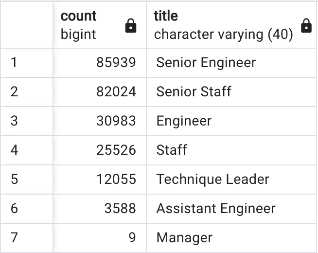
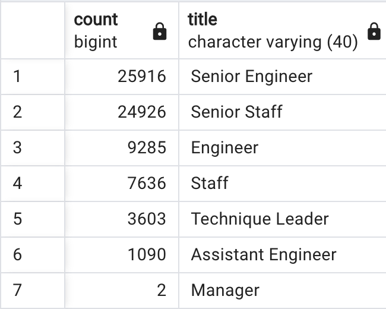
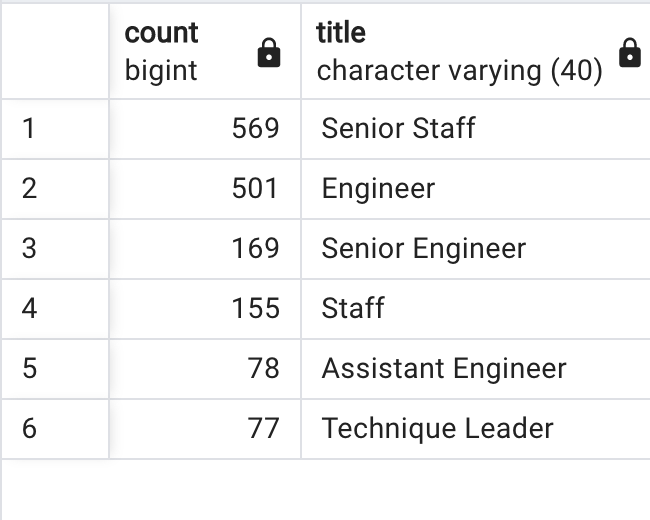
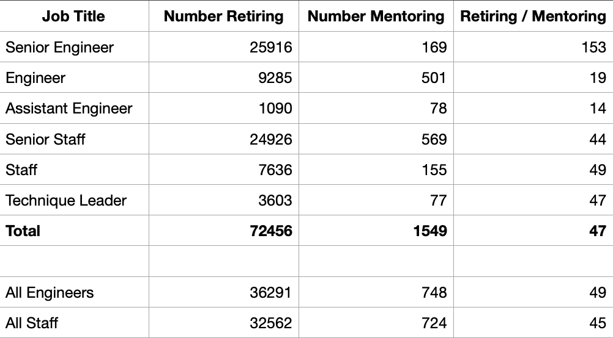

# Analysis of the Pewlett Hackard Database
A Retirement Study of the Upcoming Boomer Generation "Silver Tsunami"

## Overview
Like most companies, Pewlett Hackard is facing an impending "Silver Tsunami" of retirements: the Baby Boomer Generation (born 1946 to 1964) represents a little over 21% of the United States population, and Boomers are ready to retire. How will these retirements affect Pewlett Hackard? This study documents the number of retiring employees by job title and identifies employees who could participate in a mentorship program designed to replace the intellectual and business capital lost to retirement.

## Results
In this study, an employee is eligible for retirement if they were born in the four years spanning 1952 through 1955. An employee is eligible for the mentorship program if they were born in 1965.

- The total number of employees eligible for retirement is 72,456 (the number of employees in the unique_titles table, deliverable 1), which represents 30% of the 240,124 people that Pewlett Hackard currently employs. The number of current employees is found from the following query:

        -- Number of Pewlett Hackard employees: 240,124
        SELECT COUNT(emp_no)
        FROM dept_emp
        WHERE to_date = '9999-01-01';

- The number of employees who are eligible for retirement by job title is shown in fig. 1b. As one would expect, the largest number of Engineers and Staff are at the Senior level. Also, two managers of the nine departments are slated for retirement soon.

- The employees eligible for the mentorship program were identified in the table mentorship_eligibility and the corresponding exported csv file. The total number of employees eligible for the mentorship program is 1,549 employees, which is only 2% of 72,456 employees being lost to impending retirement.

- To extend the retirement analysis, the total number of current employees by job title was found by the following query:

        -- Number of Pewlett Hackard employees by title
        SELECT COUNT(emp_no),
               title
        FROM titles
        WHERE to_date = '9999-01-01'
        GROUP BY title
        ORDER BY COUNT(emp_no) DESC;
    The results are shown in fig. 1a. Senior Engineers and Senior Staff compose most of the PH workforce.

    The mentorship breakdown by job title was found by the following query:

        -- Number of mentors by job title
        SELECT COUNT(emp_no),
               title
        FROM mentorship_eligibility
        GROUP BY title
        ORDER BY COUNT(emp_no) DESC;
    The results are shown in fig. 1c. Senior Staff are well represented, but mentoring Engineers are more prevalent than Senior Engineers by a factor of three.

Total Titles | Retiring Titles | Mentor Titles
:-----:|:-----:|:-----:
 |  | 
Fig 1a. pgAdmin output of the number of current PH employees by job title. | Fig 1b. pgAdmin output of the number of retirement eligible employees by job title. | Fig 1c. pgAdmin output of the number of employees eligible for the mentorship program by job title.

Ratio of Retiring to Mentoring Employees |
:-----:

Fig. 2. Ratio of employees eligible to retire to employees eligible for the mentorship program by job title. Data taken from fig. 1.

## Summary
At Pewlett Hackard, 72,456 employees are eligible for retirement, which is 30% of their total number of employees. These numbers are shocking. PH must make the difficult choice of rehiring all employees lost to retirement or downsizing.

The mentorship program seems like a promising approach to ameliorate the upcoming retirement crisis. However, upon closer inspection, it is a stop-gap measure at best. As shown in fig. 2, only one possible mentor is available for every 47 eligible retirees. Worse still, at the Senior Engineering level, only one possible mentor is available for 153 eligible retirees.

One possible solution is to open the mentorship program up to employees born from 1963 to 1967, in principle increasing the pool of mentors by five-fold. A query to find those candidate mentors would look like this:

    -- Find mentorship eligibility for a five year cohort,
    -- employees born between 1963 and 1967.
    SELECT DISTINCT ON (e.emp_no)
        e.emp_no,
        e.first_name,
        e.last_name,
        e.birth_date,
        de.from_date,
        de.to_date,
        ti.title
    FROM employees AS e
    INNER JOIN dept_emp AS de
    ON (e.emp_no = de.emp_no)
    INNER JOIN titles AS ti
    ON (e.emp_no = ti.emp_no)
    WHERE (de.to_date = '9999-01-01')
    AND (e.birth_date BETWEEN '1963-01-01' AND '1967-12-31')
    ORDER BY e.emp_no;

This initiative would reduce the number of eligible retirees to possible mentors to under 10. This solution is not perfect, but is considerably better than restricting the mentorship program to those born in just one year.

